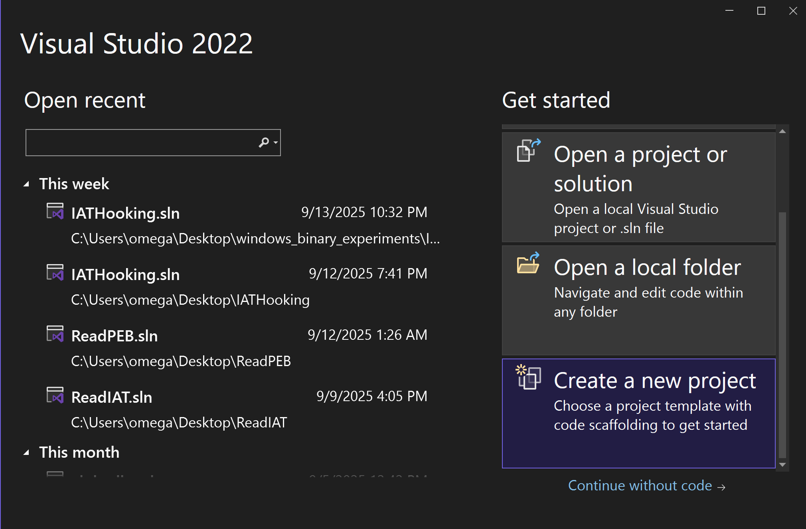

この Windows バイナリ実験講義では、PE ファイル、プロセスに焦点を当て、実験を通して攻撃・防御手法、ソフトウェア・リバースエンジニアリングの手法について学習する。こういった知見はマルウェア解析やフォレンジックには必須だし、最近はペネトレーションテストなどの、EDR・アンチウイルス製品の検知バイパスの文脈でも要求される場合がある。セキュリティ業界で汎用的な知見を得ることができるだろう。

講義資料の中では、リバースエンジニアリングで一般的なキーワードが散りばめられている。事前準備の段階や、講義の中で何か分からないことがあれば、こういったキーワードを起点に調べてみると、有用な情報が見つかるかもしれない。

また、必須ではないが、本講義の中ではいくつかの演習問題が登場する。ぜひ、自分で手を動かして解いてみてほしい。

## 環境構築
本講義は x64 の Windows 10/11 環境を前提にしている。講義では以下のツールを使用する。適宜ダウンロード・インストールのこと。

* [Visual Studio](https://visualstudio.microsoft.com/downloads/)
* [Binary Ninja](https://binary.ninja/free/)
* [WinDbg](https://learn.microsoft.com/en-us/windows-hardware/drivers/debugger/)
* [PE-bear](https://github.com/hasherezade/pe-bear/releases)
* Zydis

TODO
Zydis については、配布する Zycore.dll、Zydis.dll、.lib を任意の箇所にコピーし、PATH を通す。
includes フォルダを...

本講義は主に上記のツールを使用するが、講義内容、演習問題は、特に解析環境に依存しない。サポートはできないものの、以下のツールを代わりに使用することも可能:

* IDA Pro
* Ghidra

## Windows Programming 101
### Visual Studio

Windows の開発で主流の統合開発環境 (IDE)。ここでは簡単な使い方を解説する。

Create a new project を選択し、Console App を指定、プロジェクト名・保存先を指定して、プロジェクトを作成する。



プロジェクト作成後、Project > <Project 名> Properties より、プロジェクトの設定を変更できる。よく使うのは、ヘッダを追加するために C/C++ > General > Additional Include Directories


ライブラリを追加するために Linker > Input > Additional Dependencies など


ビルド、Release/Debug

#### Exercise 0.1 (フラグなし)

HelloWorld.sln を Visual Studio で開き、ビルド、実行してみよう。

### x86_64 命令セット

CPU がデータを扱う際、メモリかレジスタを経由して読み書きを行う。x64 環境のレジスタは、以下のような種類がある:

| Registers | Usage |
| --- |
| rax |
| rbx |
| rcx |
| rdx |
| rsi |
| rdi |
| rbp | スタックフレームの終端アドレス |
| rsp | スタックフレームの先頭アドレス |
| rip | プログラムが現在実行している命令位置 |
| r8 |
| r9 |
| r10 |
| r11 |
| r12 |
| r13 |
| r14 |
| r15 |

命令の記法については AT&T と Intel のシンタックスがあるが、本講義では Intel シンタックスに準拠して説明する。この場合、基本的に `opcode dst, src` という順番で読めばいい。例えば、以下の `mov` 命令は、`rcx` という目的地に対して、`0x1234` という値を書き込むという意味になる:

```asm
mov rcx, 0x1234;
```

メモリから値を読み込んだり、書き込んだりする場合:

```asm
; 0x1234 から値を読んで rax に保存
mov rax, QWORD PTR [0x1234];
; rbx の値を 0x1234 へ保存
mov QWORD PTR [0x1234], rbx;
```

アドレスの計算を行う際は、しばしば `lea` 命令が用いられる:

```asm
; rbx にベースのアドレス、rax がインデックスで、計算結果のアドレスを rsi に保存
lea rsi, [rbx + 8*rax];
```

`cmp` 命令は値の比較を行う:

```asm
cmp rax, rbx;
```

比較結果に応じて、RFLAGS レジスタの中の ZF と CF フラグが変化する

| Condition | ZF | CF |
| --- | --- | --- |
| rax > rbx | 0 | 0 |
| rax = rbx | 1 | 0 |
| rax < rbx | 0 | 1 |

以下の命令は、ZF フラグの値に応じてジャンプ先を変更する:

```
; ZF=1
je hoge
jz hoge
; ZF=0
jne fuga
jnz fuga
```

関数を呼び出す際、`call` 命令を、関数が呼び出し元に帰る際は、`ret` 命令が使用される。

```c
void caller() {
    callee(arg1, arg2);
}
```

```asm
; 呼び出し
call callee_address;
```

```c
void callee() {
    return;
}
```

```asm
; 帰る
ret;
```

関数呼び出しが行われるとき、スタックというメモリの領域を使用して、`caller` の情報が保存される。スタック領域は FILO (First In Last Out) のデータ構造で、`call` 命令は、呼び出し元のアドレスをスタックに積んだ後、呼び出し先の処理に遷移する:

```
| caller_address | <- rsp
```

`callee` に遷移すると、**関数のプロローグ**という処理が行われ、`callee` が使用できる領域 (スタックフレーム) が確保される。ローカル変数はこの領域に保存される。rbp が下限、rsp が上限を示す:

```
| .............. | <- rsp
| .............. |
| caller_address | <- rbp
```

`callee` が終了する際は、**関数のエピローグ**という処理が発生し、呼び出された際の状態にスタックフレームを修正する:

```
| caller_address | <- rsp
```

最後に、積まれた呼び出し元関数のアドレスを復元し、処理は終了。

また、x64 の慣習 (`__fastcall`) では、引数は rcx, rdx, r8, r9 の順に保存されて渡される。

以上、ここでは最小限の説明に留めたが、必要に応じて [Software Developer Manual](https://cdrdv2.intel.com/v1/dl/getContent/671110) なども参照することを推奨する。

#### Exercise 0.2
レジスタの中身をスタックに積みたい。このとき、どの命令を使えばいいだろうか?

#### Exercise 0.3
`mov` 命令 (89 /r) で ebx レジスタの値を ecx レジスタに移動したい。このとき、ModR/M バイトが示す値は何になるだろうか? 16進数で答えよ。

ModR/M については、Software Developer Manual の2.1節を参照のこと。

## PE ファイル
Windows の実行可能ファイルで、.exe、.dll、.sys などの拡張子を持つ。実行時には仮想メモリ上に展開される。ちなみに他の有名な実行可能ファイルとしては、ELF ファイルがある。

TODO: Visualize Sections

* DOS header
* NT headers
* File header
* Optional header
* Section headers

### DOS header
https://0xrick.github.io/win-internals/pe3/

MZ というマジックナンバーが必ず入る。マルウェアが動的にファイルをメモリに読み込む際は、大体 `if (buf[0] == 'M' and buf[1] == 'Z')` のようなチェックが入るため、この2文字が解析のヒントになる場合がある。

### Section headers
https://0xrick.github.io/win-internals/pe5/

PE ファイルはセクションという複数の領域に分かれており、セクションヘッダが指定する RVA (Relative Virtual Address) に各セクションは配置される。

### .text section
プログラムが保存されているセクション。

推論
まず、文字列、シンボル名など分かりやすい部分から埋めていく

## リバースエンジニアリング 101
### PE-bear


### Binary Ninja


### WinDbg


### Exercise 0.4

Binary Ninja、WinDbg で解析してみよう

### Exercise 0.5
WinDbg で解析
