この Windows バイナリ実験講義では、PE ファイル、プロセスに焦点を当て、実験を通して攻撃・防御手法、ソフトウェア・リバースエンジニアリングの手法について学習する。こういった知見はマルウェア解析やフォレンジックには必須だし、最近はペネトレーションテストなどの、EDR・アンチウイルス製品の検知バイパスの文脈でも要求される場合がある。セキュリティ業界で汎用的な知見を得ることができるだろう。

講義資料の中では、リバースエンジニアリングで一般的なキーワードが登場する。事前準備の段階や、講義の中で何か分からないことがあれば、こういったキーワードを起点に調べてみると、有用な情報が見つかるかもしれない。いくつかの英語で書かれた参考文献が登場するが、現実世界でも一次ソースやトレーニングなどはほぼ英語で提供されており、避けては通れない。適宜翻訳ツールなどを用いて読解に挑戦してみよう。

また、必須ではないが、本講義の中ではいくつかの演習問題が登場する。ぜひ、自分で手を動かして解いてみてほしい。

## 環境構築
本講義は x64 の Windows 10/11 環境を前提にしている。講義では以下のツールを使用する。適宜ダウンロード・インストールのこと。

* [Visual Studio](https://visualstudio.microsoft.com/downloads/)
* [Binary Ninja](https://binary.ninja/free/)
* [WinDbg](https://learn.microsoft.com/en-us/windows-hardware/drivers/debugger/)
* [PE-bear](https://github.com/hasherezade/pe-bear/releases)
* Zydis

Zydis については、ビルド済みのライブラリを講義の中で配布予定。

> [!NOTE]
> 本講義は主に上記のツールを使用するが、講義内容、演習問題は、特に解析環境に依存しない。サポートはできないものの、IDA Pro、Ghidra、OllyDbg、x64dbg などのツールを代わりに使用することも可能。

### Visual Studio

Windows の開発で主流の統合開発環境 (IDE)

#### Installation

Visual Studio Installer を起動し、Visual Studio 2022 をインストールする。この際、C++ の開発環境がチェックされていることを確認する。


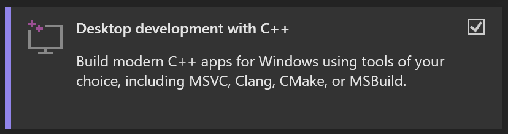

#### Usage

ここでは簡単な使い方を解説する。

Create a new project を選択し、Console App を指定、プロジェクト名・保存先を指定して、プロジェクトを作成する。

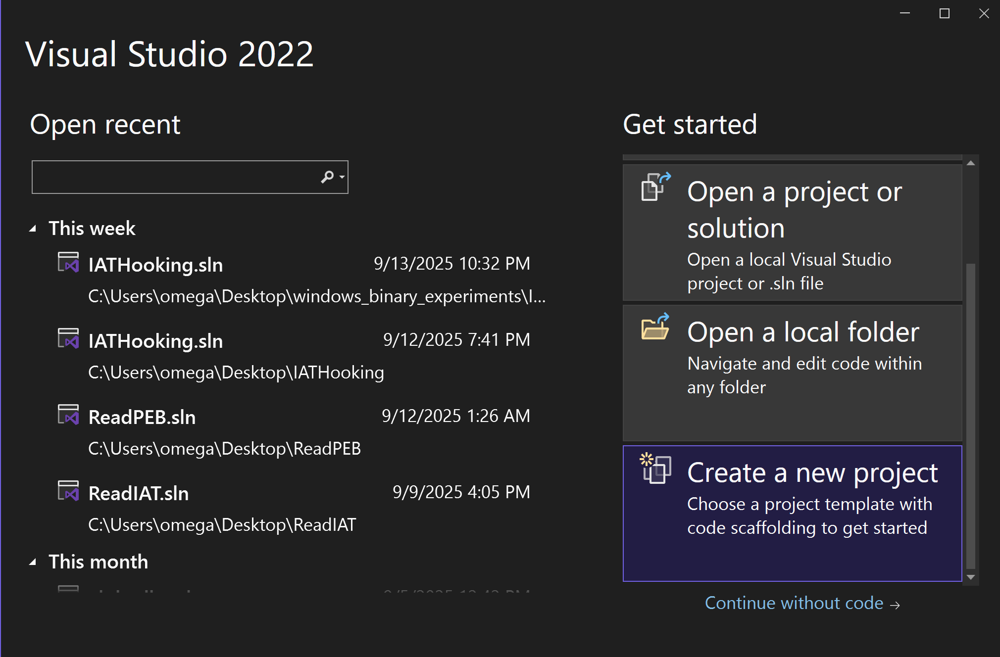
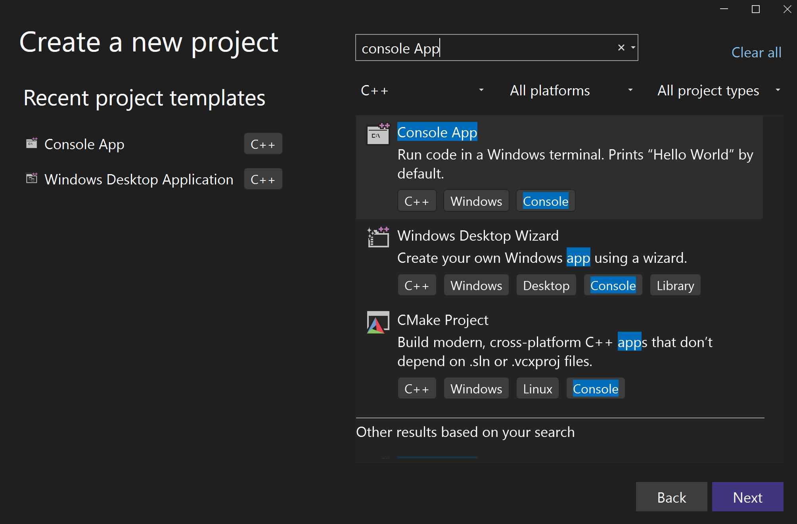
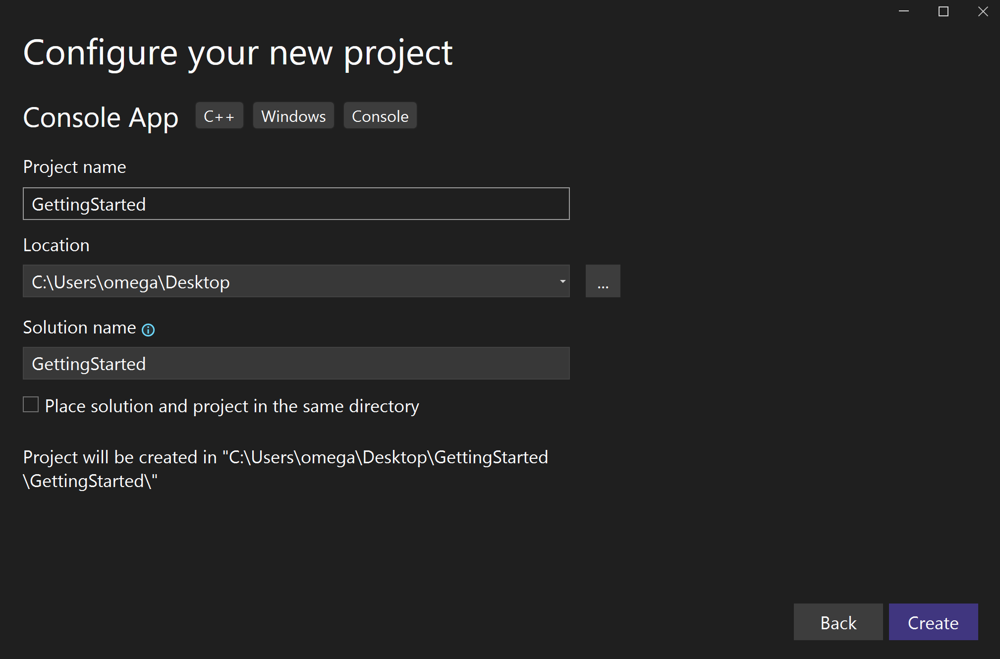

プロジェクト作成後、`Project > <Project 名> Properties` より、プロジェクトの設定を変更できる。よく使うのは、ヘッダファイルの参照先フォルダを追加する `C/C++ > General > Additional Include Directories`

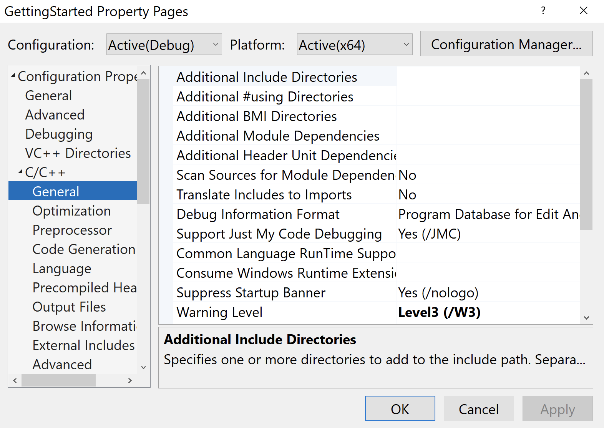

ライブラリを追加する `Linker > Input > Additional Dependencies` など

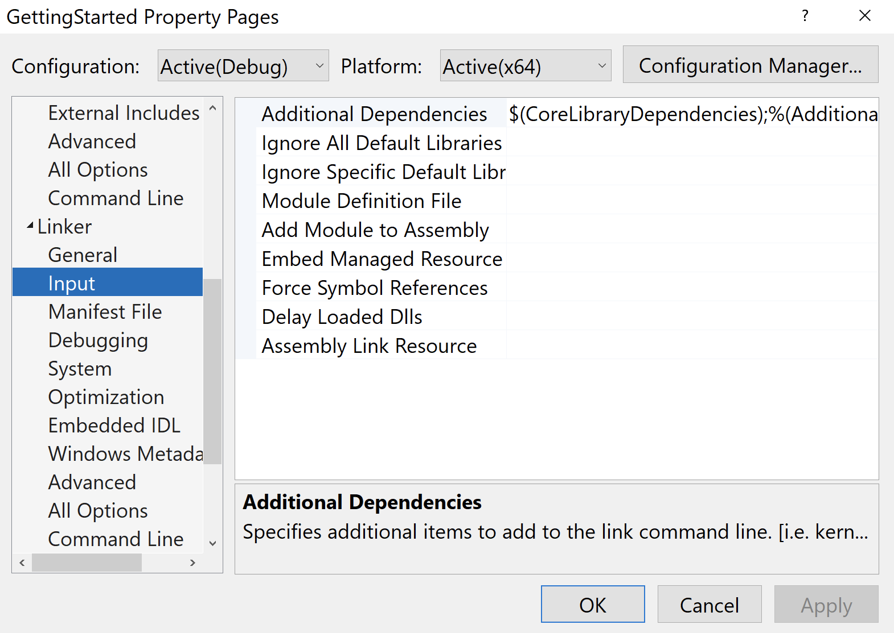

また、Visual Studio のプロジェクトの多くが Release/Debug という2つの構成を最低限持っており、デバッグ情報を含むかといった違いがある。

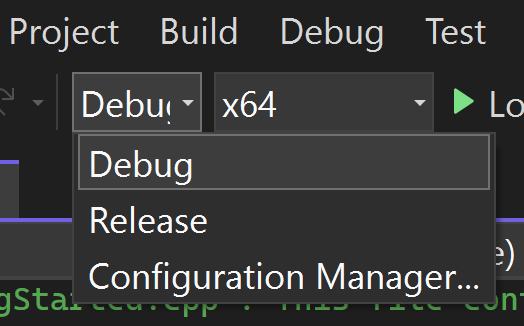

### Exercise 0.1 (フラグなし)

`HelloWorld/HelloWorld.sln` をダブルクリックして開き、Local Windows Debugger をクリックして実行してみよう。

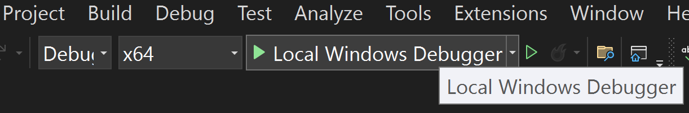

## x86_64 命令セット
現代の企業環境では、Intel の x86_64 アーキテクチャの上で Windows が動いている場合が多い。したがって、最低限 x64 環境の用語や命令を押さえておく必要がある。この節では、x86_64 の命令セットについて簡単に解説する。

> [!TIP]
> Microsoft は Surface という PC を開発しているが、一般ユーザ向けには現在、ARM ベースの Snapdragon が搭載されたモデルしか販売していない。Microsoft の ARM 重視のスタンスが表れており、将来的にはセキュリティ業界でも、ARM 環境の案件が増えているかもしれない。

CPU がデータを扱う際、メモリかレジスタを経由して読み書きを行う。x64 環境のレジスタは、以下のような種類がある:

| Register | Usage |
| --- | --- |
| rax ||
| rbx ||
| rcx ||
| rdx ||
| rsi ||
| rdi ||
| rbp | スタックフレームの終端アドレス |
| rsp | スタックフレームの先頭アドレス |
| rip | プログラムが現在実行している命令位置 |
| r8 ||
| r9 ||
| r10 ||
| r11 ||
| r12 ||
| r13 ||
| r14 ||
| r15 ||

命令の記法については AT&T と Intel のシンタックスがあるが、本講義では Intel シンタックスに準拠して説明する。この場合、基本的に `opcode dst, src` という順番で読めばいい。例えば、以下の `mov` 命令は、`rcx` という目的地に対して、`0x1234` という値を書き込むという意味になる:

```asm
mov rcx, 0x1234;
```

メモリから値を読み込んだり、書き込んだりする場合:

```asm
; 0x1234 から値を読んで rax に保存
mov rax, QWORD PTR [0x1234];
; rbx の値を 0x1234 へ保存
mov QWORD PTR [0x1234], rbx;
```

アドレスの計算を行う際は、しばしば `lea` 命令が用いられる:

```asm
; rbx にベースのアドレス、rax がインデックスで、計算結果のアドレスを rsi に保存
lea rsi, [rbx + 8*rax];
```

`cmp` 命令は値の比較を行う:

```asm
cmp rax, rbx;
```

比較結果に応じて、RFLAGS レジスタの中の ZF と CF フラグが変化する

| Condition | ZF | CF |
| --- | --- | --- |
| rax > rbx | 0 | 0 |
| rax = rbx | 1 | 0 |
| rax < rbx | 0 | 1 |

以下の命令は、ZF フラグの値に応じてジャンプ先を変更する:

```asm
; ZF=1
je hoge
jz hoge
; ZF=0
jne fuga
jnz fuga
```

関数を呼び出す際、`call` 命令を、関数が呼び出し元に帰る際は、`ret` 命令が使用される。

```c
void caller() {
    callee(arg1, arg2);
}
```

```asm
; 呼び出し
call callee_address;
```

```c
void callee() {
    return;
}
```

```asm
; 帰る
ret;
```

関数呼び出しが行われるとき、スタックというメモリの領域を使用して、`caller` の情報が保存される。スタック領域は FILO (First In Last Out) のデータ構造で、`call` 命令は、呼び出し元のアドレスをスタックに積んだ後、呼び出し先の処理に遷移する:


`callee` に遷移すると、**関数のプロローグ**という処理が行われ、`callee` が使用できる領域 (スタックフレーム) が確保される。ローカル変数はこの領域に保存される。rbp が下限、rsp が上限を示す:

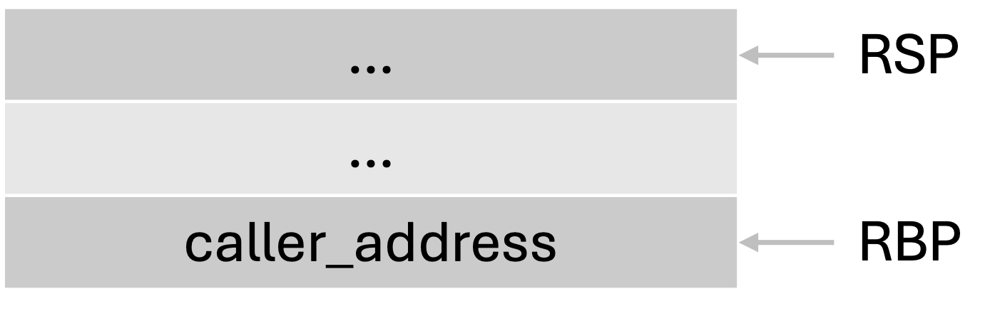

`callee` が終了する際は、**関数のエピローグ**という処理が発生し、呼び出された際の状態にスタックフレームを修正する:


最後に、積まれた呼び出し元関数のアドレスを復元し、処理は終了。

また、x64 の慣習 (`__fastcall`) では、引数は rcx, rdx, r8, r9 の順に保存されて渡される。

以上、ここでは最小限の説明に留めたが、必要に応じて [Software Developer Manual](https://cdrdv2.intel.com/v1/dl/getContent/671110) なども参照することを推奨する。

### Exercise 0.2
レジスタの中身をスタックに積みたい。このとき、どの命令を使えばいいだろうか?

### Exercise 0.3
`mov` 命令 (89 /r) で ebx レジスタの値を ecx レジスタに移動したい。このとき、ModR/M バイトが示す値は何になるだろうか? 16進数で答えよ。

ModR/M については、Software Developer Manual の2.1節を参照のこと。

## [PE ファイル](https://learn.microsoft.com/en-us/windows/win32/debug/pe-format)
Windows の実行可能ファイルで、.exe、.dll、.sys などの拡張子を持つ。実行時には仮想メモリ上に展開される。ちなみに他の有名な実行可能ファイルとしては、ELF ファイルがある。

PE ファイルは以下のヘッダから構成されている:

* DOS header
* NT headers
* File header
* Optional header
* Section headers

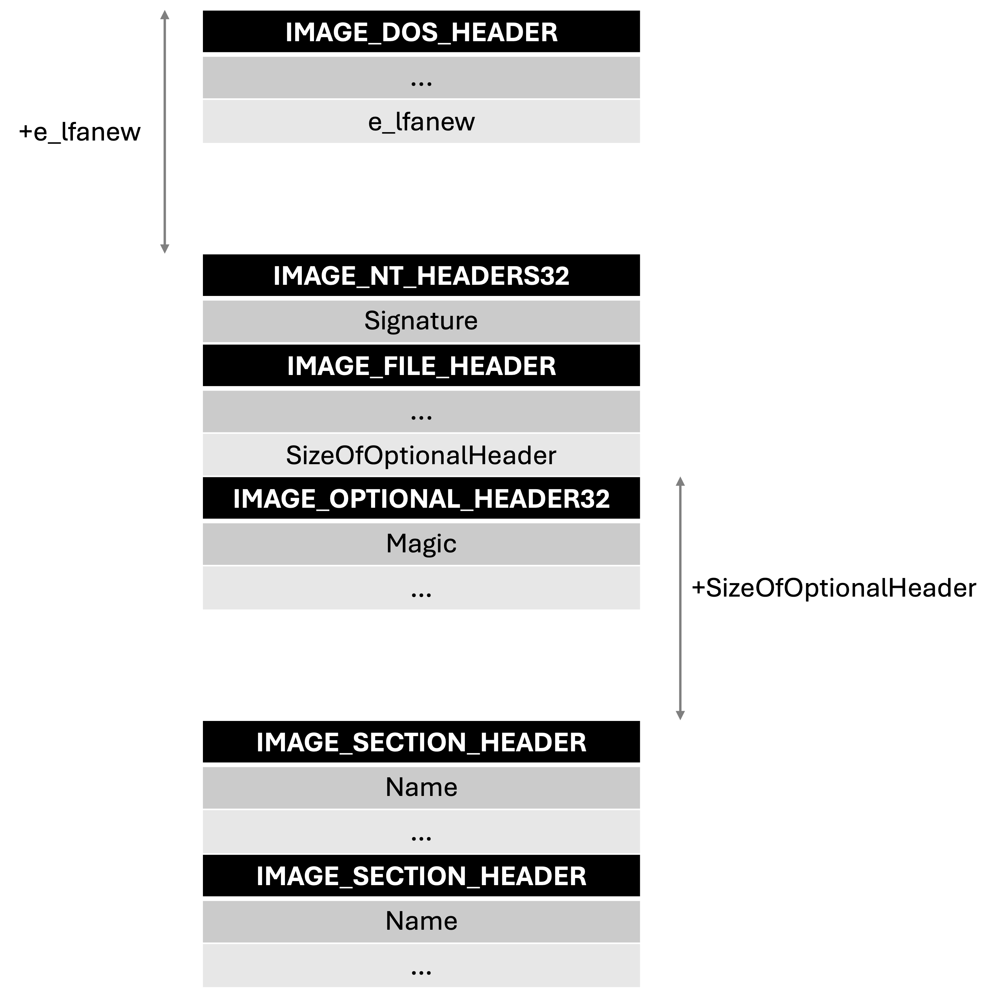

```c
PIMAGE_DOS_HEADER        pDOSHeader = (PIMAGE_DOS_HEADER)lpPE;
PIMAGE_NT_HEADERS64      pNTHeaders = (PIMAGE_NT_HEADERS64)(lpPE + pDOSHeader->e_lfanew);
PIMAGE_FILE_HEADER       pFileHeader = &pNTHeaders->FileHeader;
PIMAGE_OPTIONAL_HEADER64 pOptHeader = &pNTHeaders->OptionalHeader;
// Note: section headers reside right after an optional header
PIMAGE_SECTION_HEADER    aSecHeaders = (PIMAGE_SECTION_HEADER)((DWORDLONG)pOptHeader + pFileHeader->SizeOfOptionalHeader);
```

### [DOS header](https://0xrick.github.io/win-internals/pe3/)

MZ というマジックナンバーが必ず入る。マルウェアが動的にファイルをメモリに読み込む際は、大体 `if (buf[0] == 'M' and buf[1] == 'Z')` のようなチェックが入るため、この2文字が解析のヒントになる場合がある。

### [Section headers](https://0xrick.github.io/win-internals/pe5/)

PE ファイルはセクションという複数の領域に分かれており、セクションヘッダが指定する RVA (Relative Virtual Address) に各セクションは配置される。

### .text section
プログラムが保存されているセクション。

## リバースエンジニアリング 101
さて、この節では、簡単なリバースエンジニアリングに挑戦する。リバースエンジニアリングに限らずコードリーディング全般に言えることだが、大前提として、全てのコードを理解する必要はなく、読まなくて済むならその方がいい。実際、セキュリティに関わるリバースエンジニアリングにおいては、特定の脆弱性を見つけたい、マルウェアの通信先を見つけたいといった何らかの目的がある。バグハンティングであれば、文字列をパースするような怪しい箇所、マルウェア解析であれば、通信系の API を使う箇所といったあたりをつけ、本質とは関係のないコードは読み飛ばしてしまおう。

もう1つ、元の処理を復元するにあたって、対象に関する知識は多ければ多いほどよく、分かる部分から埋めていく必要がある。まずは規格やブログ記事、GitHub 上での実装例などの公開情報がないか調べてみよう。コードリーディングの段階では、文字列、API 名、定数などが大きなヒントになる。

### Binary Ninja を使用した解析手順

Binary Ninja は Vector 35 が開発するデコンパイラ・ディスアセンブラで、使いやすい UI と自動化 API を持つ。基本機能は無料で使用でき、API などの追加機能も IDA Pro よりも低価格で利用できる。

ウィンドウに .exe ファイルをドラッグ&ドロップするか、`File > Open` から選択することで、自動的に解析が開始される。

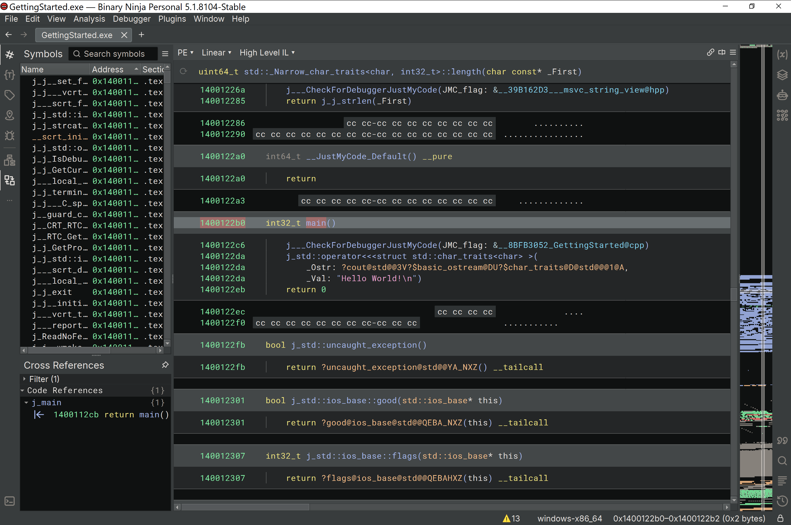

中央に解析されたコードが表示され、一番上のプルダウンから、ディスセンブリ、疑似 C コードなどの表示する内容を変更可能。

左上には関数名などのシンボル一覧が表示される。

左下の Cross References には、現在中央に表示されている関数を呼んでいる箇所が表示される。

### WinDbg を使用した解析手順
Microsoft 製のデバッガで、動的解析の用途では、ほぼデファクトスタンダードのツールと言っていい。

左上の File をクリックし、`Launch executable` から実行ファイルを選択するとデバッグが開始する。`Launch executable (advanced)` では、プログラムに渡す引数を指定できる。

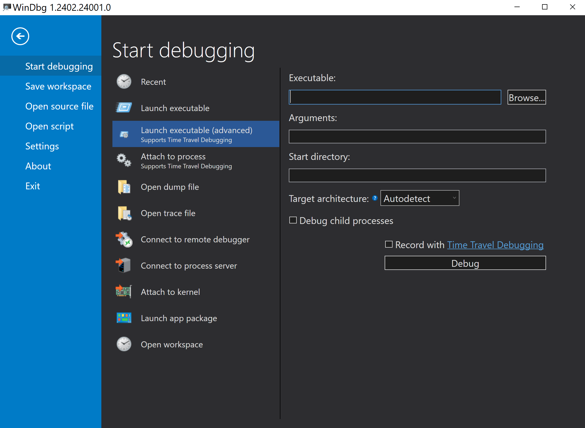

デバッガを用いた解析は、基本的にブレークポイントをアドレスに設定、その箇所まで実行し、レジスタやメモリの中身を確認、という流れで進んでいく。以下、WinDbg でよく使用するコマンドをまとめておく:

| Command | Usage |
| ---     | ---   |
| bp | ブレークポイントの設定 |
| g  | 次のブレークポイントまで実行 |
| r  | レジスタの情報を表示 |
| p  | ステップアウト実行 (関数の中に入らない) |
| t  | ステップイン実行 |

### Exercise 0.4
ex_0x04.exe は特定の引数が渡されると、`Matched!` と出力する。Binary Ninja、WinDbg で解析してみよう。引数がフラグ。

### Exercise 0.5
ex_0x05.exe は、関数を呼び出すために main 関数のリターンアドレスを書き換える難読化のテクニックを用いている。最終的にどの関数が呼ばれるだろうか。Binary Ninja、WinDbg で解析し、その関数のアドレスを16進数で答えてほしい。
